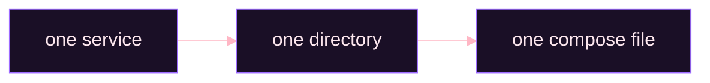
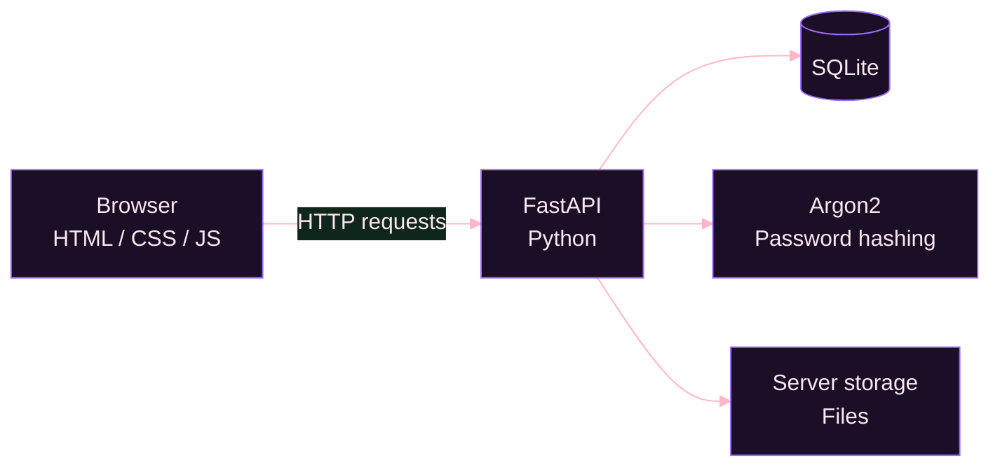

<!--
  README de perfil - Eduardo M. Muller
  Identidade: dark / minimal / developer portfolio
  Paleta: #0b0710 #1a0f26 #2d1547 #9d6bff #ffb7c5 #e8d9f2 #fde7ee
  Assets (pasta assets/):
    header.svg, digitando.svg, rodape.svg           -> originais
    onda-animada.svg, onda-linha.svg                -> divisores em onda (grande e fina)
    ilustracao-areas / -mycloud / -cloudnest /
    -helpdesk / -homelab / -ciclo .svg              -> ilustracoes das secoes
  Ondas: header.svg abre, onda-animada.svg separa os blocos, onda-linha.svg separa projetos, rodape.svg fecha
-->


<div align="center">


<h1>Eduardo M. Muller</h1>


<p><strong>Developer em formação · Web Development · Linux · Self-hosting</strong></p>

<p>
Construo sistemas completos para entender como cada camada funciona,<br>
da interface no navegador à aplicação, banco de dados e infraestrutura.
</p>


<br><br>


</div>

<br>

<div align="center">


<br><br>


<br><br>


</div>

<br>

<div align="center">


</div>

<h2 align="center">Sobre</h2>

Sou desenvolvedor em formação construindo experiência através de projetos próprios.

Em vez de estudar tecnologias isoladamente, aplico cada conceito em algo utilizável: uma aplicação web, uma API, um serviço ou uma infraestrutura.

Acredito em entender o funcionamento por baixo da abstração. Quando possível, escrevo a lógica manualmente antes de adicionar frameworks ou bibliotecas maiores.

**Forma de trabalhar**

- Código simples, que eu consiga entender meses depois
- Dependências apenas quando necessárias
- Frontend, backend e infraestrutura bem separados
- Aprendizado através da implementação

> **Objetivo:** construir sistemas completos e entender como cada parte funciona, do navegador ao servidor.

<br>

<div align="center">


</div>

<h2 align="center">Atuação Profissional</h2>

Minha experiência está se formando em duas áreas que se conectam.

<div align="center">


</div>

### Web Development

Interfaces e sistemas web usando tecnologias fundamentais da plataforma.

| Camada | Tecnologias |
| :--- | :--- |
| Frontend | HTML, CSS, JavaScript (DOM, eventos, fetch) |
| Backend | Python, FastAPI, PHP |
| Dados | SQLite, MySQL |

### Infrastructure & Linux

Mantenho ambiente Linux próprio para experimentar servidores, containers e serviços self-hosted.

```text
Linux
 ├── Docker
 ├── Networking
 ├── Monitoring
 ├── DNS
 ├── Security
 └── Self-hosted services
```

Linux, Docker, networking, DNS, segurança e monitoramento são aplicados em um homelab ativo onde aprendo não apenas a escrever aplicações, mas também o que acontece quando elas deixam o computador do desenvolvedor.

<br>

<div align="center">


</div>

<h2 align="center">Stack</h2>

<div align="center">

<h4>Core</h4>


<h4>Aprendendo ativamente</h4>


<h4>Utilizado em projetos</h4>


</div>

<br>

| Área | Tecnologia | Experiência |
| :--- | :--- | :---: |
| Frontend | HTML | Base |
| Frontend | CSS | Base |
| Frontend | JavaScript | Aprendendo |
| Backend | Python | Base |
| Backend | FastAPI | Projetos |
| Backend | PHP | Projetos |
| Backend | Node.js | Aprendendo |
| Database | SQLite | Projetos |
| Database | MySQL | Projetos |
| Infrastructure | Linux | Uso diário |
| Infrastructure | Docker | Aprendendo |
| Infrastructure | AdGuard Home, Portainer, Netdata, Homepage, Tailscale, Fail2ban, UFW | Homelab |
| Segurança | Argon2 (hash de senhas no My Cloud); UFW, Fail2ban e Tailscale (homelab) | Projetos e homelab |
| Versioning | Git e GitHub | Aprendendo |

<br>

<div align="center">


</div>

<h2 align="center">Projetos</h2>

Os projetos abaixo, todos ainda em desenvolvimento, cobrem as duas pontas de um sistema: a interface, a API e o banco de dados, e também o servidor onde ele roda, com DNS, monitoramento, acesso remoto e firewall.

### My Cloud


Nuvem pessoal e familiar para armazenar e acessar arquivos sem depender de serviços de terceiros, hospedada em infraestrutura própria.

O projeto nasceu da vontade de entender como construir uma plataforma de armazenamento do zero: autenticação, gerenciamento de arquivos, banco de dados e comunicação entre frontend e backend.

Roda em um notebook antigo adaptado como servidor. O frontend é escrito em HTML, CSS e JavaScript puros, sem frameworks, mantendo o projeto leve.

**Stack**

      

**Planejado**

| Contas | Arquivos | Servidor |
| :--- | :--- | :--- |
| autenticação por e-mail e senha | sistema de pastas | monitoramento do servidor |
| sessão persistente | upload e download | |
| gerenciamento de usuários | drag and drop | |
| | busca de arquivos | |

<div align="center">


</div>

### CloudNest


Telas de login e cadastro da My Cloud, em tema escuro com tons de vermelho e rosa e campos com efeito de vidro fosco.

O objetivo é praticar a construção de interfaces sem depender de frameworks de frontend, trabalhando diretamente com HTML, CSS e JavaScript.

A lógica das telas está sendo escrita por mim, e o backend de autenticação também será próprio, rodando em container no servidor.

**Stack**

  

**Repository:** [github.com/eduardo-m-muller/login_screen](https://github.com/eduardo-m-muller/login_screen)

<a href="https://github.com/eduardo-m-muller/login_screen">
  
</a>

<div align="center">


</div>

### Helpdesk


Sistema de chamados para suporte técnico.

A ideia é separar claramente o fluxo entre quem abre um chamado e quem realiza o atendimento, com um painel que destaca a prioridade de cada chamado. Frontend e backend ficam organizados em pastas independentes.

**Stack**

    

**Repository:** [github.com/eduardo-m-muller/helpdesk](https://github.com/eduardo-m-muller/helpdesk)

<a href="https://github.com/eduardo-m-muller/helpdesk">
  
</a>

<div align="center">


</div>

### Homelab


Ambiente pessoal de infraestrutura Linux, onde experimento servidores, containers, monitoramento, DNS, acesso remoto e segurança. É um ambiente de estudo e uso próprio, mantido por mim.

| Categoria | Serviço | Função |
| :--- | :--- | :--- |
| Rede e acesso | AdGuard Home | DNS e filtragem |
| Rede e acesso | Tailscale | Acesso remoto |
| Gerenciamento | Portainer | Gerenciamento Docker |
| Gerenciamento | Homepage | Dashboard |
| Monitoramento | Netdata | Monitoramento |
| Segurança | Fail2ban | Proteção contra tentativas repetidas |
| Segurança | UFW | Firewall |

A organização segue uma regra simples:



Isso mantém cada serviço isolado e facilita manutenção, atualização e troubleshooting. A infraestrutura é mantida com foco em simplicidade, isolamento e baixo consumo de recursos.

<br>

<div align="center">


</div>

<h2 align="center">Arquitetura: My Cloud</h2>



A arquitetura é propositalmente simples. O navegador cuida da interface, o FastAPI concentra a lógica da aplicação, o SQLite armazena os dados, o Argon2 protege as credenciais e o próprio servidor mantém os arquivos.

<br>

<div align="center">


</div>

<h2 align="center">Aprendizado Atual</h2>

```text
JavaScript
    ├── DOM
    ├── Events
    ├── Fetch
    └── Application logic

Node.js
    └── Backend development

Docker
    ├── Containers
    ├── Networks
    └── Compose

Git
    ├── Branches
    ├── Commits
    └── Repository organization
```

O objetivo não é acumular tecnologias, mas entender como elas se conectam e conseguir construir sistemas completos com elas.

<br>

<div align="center">


</div>

<h2 align="center">Filosofia de Desenvolvimento</h2>

<div align="center">


<h3>Build it. Break it. Understand it. Improve it.</h3>

Código que consigo entender depois de alguns meses<br>
Dependências apenas quando realmente necessárias<br>
Separação clara entre frontend, backend e infraestrutura<br>
Aplicações leves sempre que possível<br>
Segurança desde o começo<br>
Aprendizado através da implementação

<br><br>


</div>

<br>

<h2 align="center">Contato</h2>

<div align="center">

Se quiser conversar sobre programação, Linux, self-hosting ou algum projeto:

<br>

<a href="https://github.com/eduardo-m-muller">
  
</a>

<br><br>

Aberto a projetos freelancer na área de desenvolvimento web.

<br><br>


<br>

<sub>Built while learning, one project at a time.</sub>

</div>
